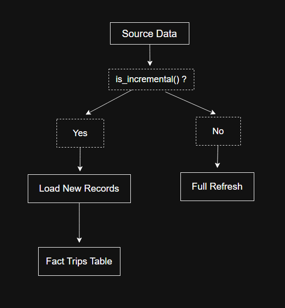
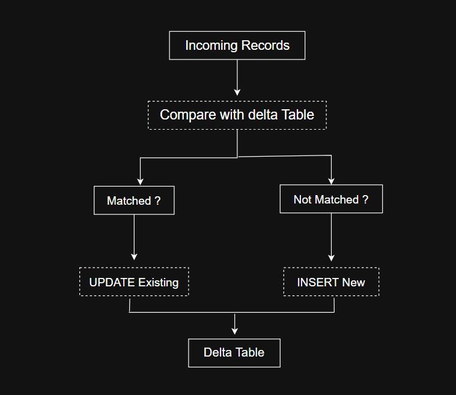
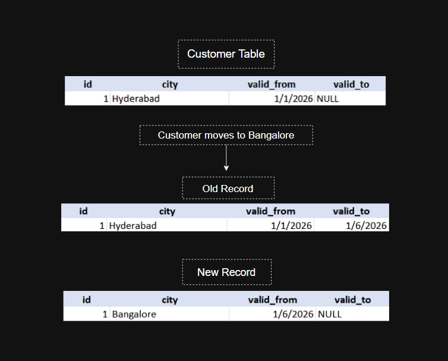

#Ride Analytics Lakehouse Pipeline

## Overview

This project is an **end-to-end data engineering pipeline** for a ride-sharing platform built using **PySpark (Databricks)** and **dbt**

The project follows a Bronze → Silver → Gold Medallion Architecture, demonstrating production-style ETL design, incremental processing, Slowly Changing Dimensions (SCD Type 2), and modular analytics engineering practices.

## Business Problem

Ride-sharing platforms generate large volumes of transactional data across customers, drivers, vehicles, trips, locations, and payments.

Business teams require reliable and analytics-ready datasets to answer questions such as:

Which customers take the most trips?
Which drivers have the highest performance?
What are the daily operational metrics?
How does customer and driver information change over time?

This project transforms raw operational data into trusted analytical datasets while preserving historical changes and supporting scalable incremental processing.

## Architecture


```
Bronze Layer (Raw Ingestion - PySpark)
        ↓
Silver Layer (Cleaned & Transformed - PySpark)
        ↓
Gold Layer (Analytics - dbt Models & Views)
```

## Tech Stack

- **PySpark (Databricks)** – Data ingestion and transformation
- **Delta Lake** – Storage layer with ACID guarantees
- **dbt (Data Build Tool)** – Data modeling and transformation
- **Git & GitHub** – Version control

## Data Pipeline

### Bronze Layer

- Raw data ingestion using **`bronze_ingestion.py`**
- Ingests data into Delta tables
- Handles initial schema loading
- Acts as the source for downstream transformations

### Silver Layer

- Implemented using **`silver_transformation.py`**
- Data cleaning and validation
- Deduplication
- Schema enforcement
- Incremental processing

### Gold Layer

#### Fact Table

- `trips` (incremental dbt model)

#### Dimension Tables (SCD Type 2 via Snapshots)

- Customers
- Drivers
- Vehicles
- Locations
- Payments

#### Business Views

- `customer_trip_summary`
- `driver_performance`
- `daily_trip_metrics`

## Key Features

- ✅ Incremental data processing
  
- ✅ Change Data Capture (CDC) handling
  
- ✅ Slowly Changing Dimensions (SCD Type 2)
  
- ✅ Modular dbt models
- ✅ Layered architecture (Bronze → Silver → Gold)
- ✅ Scalable and production-style pipeline

## Project Structure

```
ride-analytics-lakehouse/
│
├── databricks/
│   ├── bronze/
│   │   └── bronze_ingestion.py
│   │
│   ├── silver/
│   │   └── silver_transformation.py
│
├── dbt_project/
│   ├── models/
│   │   ├── marts/
│   │   │   ├── facts/
│   │   │   │   └── trips.sql
│   │   │   └── views/
│   │   │       ├── customer_trip_summary.sql
│   │   │       ├── driver_performance.sql
│   │   │       └── daily_trip_metrics.sql
│   │   └── sources/
│   │       └── sources.yml
│   │
│   ├── snapshots/
│   │   ├── scds.yml
│   │   └── facts.yml
│   │
│   ├── macros/
│   │   └── generate_schema_name.sql
│   │
│   └── dbt_project.yml
│
├── docs/
│ ├── architecture.png
│ ├── cdc_merge.png
│ ├── incremental_model.png
│ └── SCD2.png
│
├── README.md
└── .gitignore
```

## How to Run

### 1. Databricks

- Run **`bronze_ingestion.py`** to ingest raw data
- Run **`silver_transformation.py`** for cleaned datasets

### 2. dbt

Run:

```
dbt run
dbt snapshot
dbt test
```

## Use Cases

- Customer analytics
- Driver performance tracking
- Daily operational metrics
- Business intelligence reporting

## Learnings & Highlights

- Designed a **multi-layered lakehouse architecture**
- Built **scalable ETL pipelines using PySpark**
- Implemented **SCD Type 2 using dbt snapshots**
- Developed **analytics-ready data models**

## Future Improvements

- Add orchestration (Airflow / Databricks Jobs)
- Implement CI/CD pipelines
- Extended dbt data quality tests
- Integrate dashboards (Power BI / Tableau)

## Author

**Lasya Katakam**
